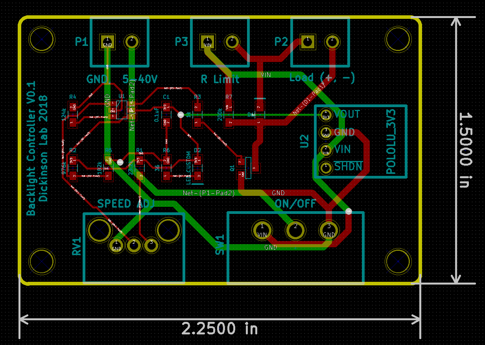

# backlight_controller 
Simple 2A LED backlight controller based on the LTC6992 voltage controlled PWM modulator. 

* [Schematic (PDF)](controller.pdf)
* [Bill-of-materials](bom.txt)

# PCB layout 

# License: 
Creative Commons Attribution 4.0 International CC BY 4.0

